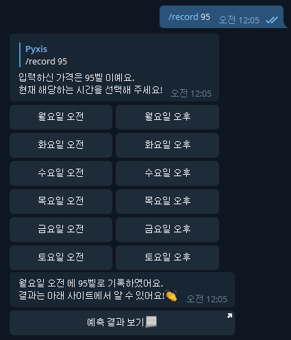
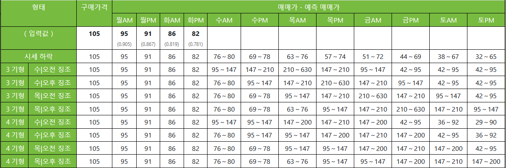

# 순무봇
   

순무봇은 **모여봐요, 동물의 숲** 의 순무 가격을 예측해 드리는 텔레그램 봇으로, [@TurnipsBot](http://t.me/turnips_bot) 를 친구 추가하여 사용할 수 있어요.

[순무봇을 사용하려면 클릭하세요.](http://t.me/turnips_bot)

## 업데이트 내역

업데이트 내역은 Github Release에 갱신되어요. https://github.com/WindSekirun/TurnipsBot/releases

## 기능들

* 이번 주에 해당하는 패턴(랜덤 패턴, 하락 패턴, Big Strike, Small Strike) 에 대한 예측 기능을 제공해요.
* 매일 오전 10시와 오후 2시, 순무 가격을 놓치지 않도록 알림으로 알려드려요.
* `/pattern` 으로 각종 패턴에 대한 설명을 볼 수 있어요.

## 간단한 사용 방법

### 순무봇 가입하기

순무봇이 예측 기능이나 알림 기능을 제공하기 위해서는 '텔레그램 고유 유저 아이디' 와 '닉네임' 이 필요해요. `/join` 을 채팅창에 입력해주시면 가입할 수 있어요.

### 이번주 무 가격 입력하기

일요일 오전, '무파니' 가 여러분의 마을에 찾아가요. 무를 구매하셨다면, 예측을 위해 구매하신 무 가격을 알려주세요.

* 만약, 94벨에 구매하셨다면 `/buy 94` 를 입력해 주세요.
* 만약, 105벨에 구매하셨다면, `/buy 105` 를 입력해 주세요.

참고로, `/buy` 기능은 기존에 기록되어 있던 데이터를 모두 삭제하고 다시 작성해요. 만일, 화요일에 `/buy` 를 사용하셨다면 월요일에 기록한 데이터가 모두 제거되니 주의해 주세요!

### 무 가격 입력하기



월요일 오전부터 토요일 오후까지, 하루 2번 '너굴상점'의 콩돌이/밤돌이 에게 무 가격을 확인할 수 있어요.

* 만약, 월요일 오전에 85벨이라면, `/record 85` 를 입력하고 '월요일 오전'을 클릭해 주세요.
* 만약, 수요일 오후에 200벨이라면, `/record 200` 를 입력하고 '수요일 오후'를 클릭해 주세요.

입력에 성공했다면, 예측 페이지에 입력하신 값이 사용되어요.



예측 페이지를 다시 보고 싶으시다면, `/result` 를 입력해 주세요.

### 알림 받기

순무봇에 가입하신 순간부터는 매일 오전 10시와 오후 2시에 구매 알림을 보내드려요.

* 만일, 구매 알림을 받고 싶지 않다면 `/notify` 를 입력해 주세요. 다시 받으려면 `/notify` 를 다시 입력해 주세요.
* 만일, 무를 전부 판매해서 이번주에 대해 알림을 받고 싶지 않다면, `/ignore` 를 입력해 주세요. 토요일 오후까지 구매 알림은 보내지 않고, 일요일 오전부터 다시 알림을 받을 수 있어요.

### 순무봇 탈퇴하기

더 이상 순무봇이 제공하는 기능이 필요하시지 않다면, `/leave` 로 탈퇴할 수 있어요. 탈퇴한 순간, 이제까지 기록했던 모든 정보가 삭제되어요.

### 버그 / 개선사항 제보하기

만약, 버그 / 개선사항을 발견하셨다면 아래 '문의' 에 있는 연락처로 제보해주세요. `/bug` 커맨드로도 문의 연락처를 볼 수 있어요.

## 커맨드 리스트

```text
start - 시작하기
help - 도움말 보기
join - 순무봇 가입하기
leave - 순무봇 탈퇴하기
notify - 알림 수신 여부 설정하기 (기본: 설정)
pattern - 순무 가격 예측 패턴 설명
buy - 이번 주 무 구매 가격 입력
record - 너굴상점의 무 가격 입력
result - 결과 페이지 확인
bug - 버그/개선사항 문의
ignore - 이번 주 알림 받기 (기본: 설정)
```

## 순무봇 코드

MIT License로 공개되어 있어요. :: https://github.com/WindSekirun/TurnipsBot

## 문의

* 메일: windsekirun@gmail.com
* 텔레그램: [@WindSekirun](http://t.me/WindSekirun)
* 트위터: [@WindSekirun](https://twitter.com/WindSekirun)